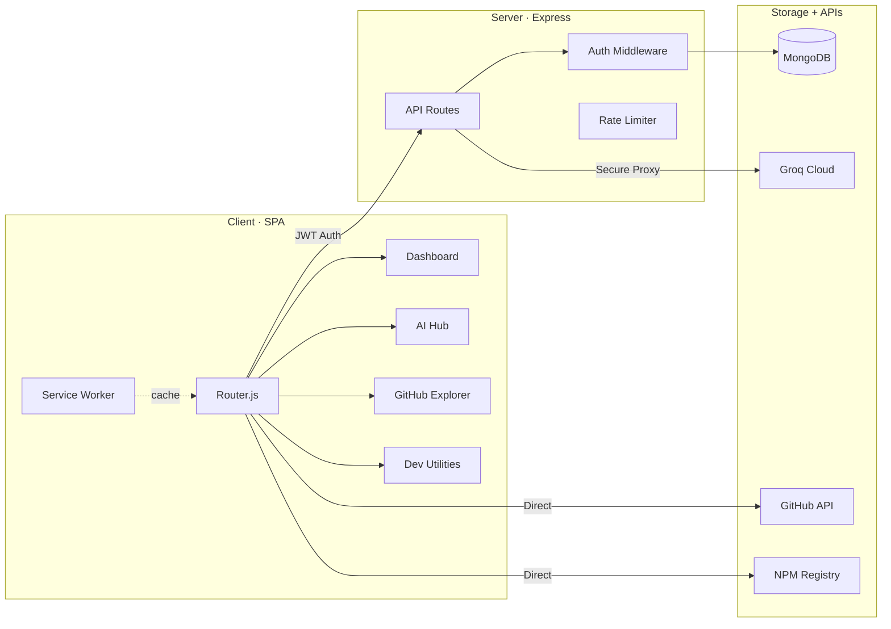

<div align="center">
  
  <br><br>

```
  ████████╗██████╗ ██╗██╗   ██╗ ██████╗ ██╗  ██╗ █████╗
  ╚══██╔══╝██╔══██╗██║██║   ██║██╔═══██╗╚██╗██╔╝██╔══██╗
     ██║   ██████╔╝██║██║   ██║██║   ██║ ╚███╔╝ ███████║
     ██║   ██╔══██╗██║╚██╗ ██╔╝██║   ██║ ██╔██╗ ██╔══██║
     ██║   ██║  ██║██║ ╚████╔╝ ╚██████╔╝██╔╝ ██╗██║  ██║
     ╚═╝   ╚═╝  ╚═╝╚═╝  ╚═══╝   ╚═════╝ ╚═╝  ╚═╝╚═╝  ╚═╝
```

  <h3>A Unified, High Performance Workspace for Modern Engineers</h3>

<a href="https://makeapullrequest.com"></a>
<a href="#"></a>

  <br>
  <sub>Express proxy backend · MongoDB persistence · Groq AI inference</sub>
</div>

<br>

<table>
<tr>
<td>

**TrivoXa** is a browser based developer toolkit that consolidates scattered utilities into a single, cohesive workspace. It combines AI powered project scaffolding, 3D repository visualization, package analysis, API testing, and a personal developer workspace into one monochrome interface engineered for deep work.

No heavy setup. No framework dependencies on the frontend. Just open it and start building.

</td>
</tr>
</table>

<br>

## System Architecture



<br>

<table>
<tr>
<td width="50%">

### Frontend Engine

| Component    | Implementation                              |
| :----------- | :------------------------------------------ |
| Language     | Vanilla JS (ES6+ modules)                   |
| Styling      | Custom CSS design system with CSS variables |
| Routing      | Custom SPA router with history API          |
| 3D Rendering | Three.js + 3D Force Graph (lazy loaded)     |
| Offline      | PWA with service worker caching             |

</td>
<td width="50%">

### Backend Infrastructure

| Component | Implementation                        |
| :-------- | :------------------------------------ |
| Runtime   | Node.js with Express                  |
| Database  | MongoDB via Mongoose ODM              |
| Auth      | JWT tokens with bcryptjs hashing      |
| AI Layer  | Groq Cloud (Llama 3.1 models)         |
| Security  | CORS, rate limiting, input validation |

</td>
</tr>
</table>

<br>

## Modules

<br>

<table>
<tr>
<td width="65%">

### `01` AI Hub

An intelligent development environment backed by Groq's high speed inference.

**AI Chat** provides a stateful, context aware assistant for debugging errors, refactoring code, designing schemas, and discussing architectural decisions.

**AI Architect** accepts high level project descriptions and generates complete directory structures paired with executable terminal scaffolding scripts.

**AI Stacks** evaluates technology combinations for targeted builds, analyzing compatibility, performance, and ecosystem maturity.

```bash
# Output from AI Architect
mkdir -p project/{backend/routes,frontend/components,shared}
cd project && npm init -y && npm i express mongoose dotenv
```

</td>
<td width="35%" valign="top">

<br>

> **Use when you need to:**
>
> Scaffold a new project from scratch
>
> Debug a complex runtime error
>
> Compare tech stack tradeoffs
>
> Generate database schemas
>
> Prototype an API design

</td>
</tr>
</table>

<br>

<table>
<tr>
<td width="35%" valign="top">

<br>

> **Workspace stores:**
>
> Project folders with hierarchy
>
> Bookmarked APIs and tools
>
> AI chat conversation exports
>
> CLI command references
>
> Code snippets and notes

</td>
<td width="65%">

### `02` My Workspace

A centralized productivity layer to organize project resources and reduce context switching.

**Project Folders** let you create custom directory structures in the browser to group notes, endpoints, tool bookmarks, and command references by project.

**Resource Bookmarks** connect directly to the Free APIs index, Tools Vault, and AI Chat history. Save any resource to your active project folder with a single click.

**Quick Notes** support rich text and code block storage alongside your bookmarks, keeping documentation and planning materials in one place.

</td>
</tr>
</table>

<br>

<table>
<tr>
<td width="65%">

### `03` GitHub Explorer

Spatial visualization of repository architectures using WebGL rendering.

**3D Repo Visualizer** renders any public GitHub repository as a force directed graph. Directories become clusters, files become nodes, and depth relationships become visible spatial connections. Built on `Three.js` and `3D Force Graph`, both loaded on demand.

**Git Insights** surfaces repository metrics, language distribution, and configuration details in a unified view.

**User Explorer** lets you search GitHub profiles to analyze contributor patterns, repository ownership, and public activity.

</td>
<td width="35%" valign="top">

<br>

> **Designed for:**
>
> Onboarding to unfamiliar codebases
>
> Auditing repository structure
>
> Understanding dependency graphs
>
> Reviewing contributor activity
>
> Comparing project architectures

</td>
</tr>
</table>

<br>

<table>
<tr>
<td width="35%" valign="top">

<br>

> **Includes:**
>
> 100+ public REST endpoints
>
> Live response previews
>
> NPM download velocity charts
>
> Bundle size comparisons
>
> Git, Docker, Linux cheat sheets
>
> Coding assistant directory

</td>
<td width="65%">

### `04` Developer Utilities

A consolidated suite of essential tools designed to eliminate tab switching during development.

**Package Scout** performs deep analysis on NPM packages, surfacing download trends, bundle overhead, dependency trees, and maintenance indicators before you add them to your project.

**Free APIs Directory** indexes over 100 public REST endpoints across categories, with built in sandbox testing to preview response structures directly in the interface.

**Tools Vault** catalogs framework boilerplates, technical libraries, coding assistants (Claude Code, Copilot CLI, Gemini CLI, Codex, Aider, Continue), and VS Code extensions.

**Commands Library** provides searchable CLI references for Git, NPM, Docker, Linux, and Terminal operations with copy to clipboard support.

**Docs Search** connects to technical documentation sources with persistent search history tracking.

</td>
</tr>
</table>

<br>

## API Reference

All protected routes require a `Bearer <token>` header. Rate limits are enforced per IP.

```
                                    ┌─────────────────────────────────────┐
                                    │         AUTHENTICATION              │
                                    └─────────────────────────────────────┘
```

| Route                | Method | Auth   | Rate Limit      | Description                       |
| :------------------- | :----- | :----- | :-------------- | :-------------------------------- |
| `/api/auth/register` | `POST` | Public | 10 req / 15 min | Create account, receive JWT       |
| `/api/auth/login`    | `POST` | Public | 10 req / 15 min | Validate credentials, receive JWT |
| `/api/auth/me`       | `GET`  | JWT    | Global          | Retrieve current session data     |

```
                                    ┌─────────────────────────────────────┐
                                    │         AI & WORKSPACE              │
                                    └─────────────────────────────────────┘
```

| Route               | Method                | Auth | Rate Limit      | Description                        |
| :------------------ | :-------------------- | :--- | :-------------- | :--------------------------------- |
| `/api/groq/chat`    | `POST`                | JWT  | 20 req / 15 min | Stream AI response from Groq       |
| `/api/ai-history`   | `GET` `POST` `DELETE` | JWT  | Global          | Manage saved AI conversations      |
| `/api/snippets`     | `GET` `POST` `DELETE` | JWT  | Global          | CRUD for workspace code snippets   |
| `/api/docs-history` | `GET` `POST` `DELETE` | JWT  | Global          | Track documentation search queries |

<br>

## Project Layout

```
trivoxa/
│
├── api/                    # Serverless function entry points (Vercel)
├── server/
│   ├── config/             # Database connection configuration
│   ├── middleware/          # JWT auth verification middleware
│   ├── models/             # Mongoose schemas (User, Snippet, History)
│   └── routes/             # Express route handlers
│       ├── auth.js         #   Registration, login, session
│       ├── groq.js         #   Groq AI proxy with streaming
│       ├── snippets.js     #   Workspace snippet CRUD
│       ├── aiHistory.js    #   AI conversation persistence
│       └── docsHistory.js  #   Documentation search tracking
│
├── js/
│   ├── core/               # SPA router engine and boot system
│   ├── ai/                 # AI Chat, Architect, Stacks interfaces
│   ├── auth/               # Login/register modals and JWT management
│   ├── dashboard/          # Landing page and primary workspace UI
│   ├── docs/               # Documentation search engine
│   ├── git/                # 3D repository explorer (Three.js)
│   ├── tools/              # Package Scout, APIs, Tools Vault, Commands
│   ├── workspace/          # Folder trees, notes, snippet management
│   ├── ui/                 # Navbar, layouts, loading states
│   └── utils/              # Fetch wrappers, DOM helpers, formatters
│
├── css/
│   ├── base.css            # Reset, typography, CSS custom properties
│   ├── layout.css          # Grid systems, responsive breakpoints
│   ├── components.css      # Reusable UI component styles
│   ├── pages.css           # Page specific module styles (imports)
│   └── animations.css      # Keyframes and transition definitions
│
├── data/
│   ├── apis.json           # 100+ public API endpoint catalog
│   ├── commands.json       # Git, NPM, Terminal, Docker CLI reference
│   ├── tools.json          # Developer tools and assistant directory
│   └── extensions.json     # VS Code extension recommendations
│
├── public/                 # Favicon, manifest, icons, service worker
├── scripts/                # Setup and diagnostic test scripts
├── index.html              # SPA shell and entry point
├── package.json            # Dependencies and npm scripts
└── vercel.json             # Serverless deployment configuration
```

<br>

## Setup

<details>
<summary><b>Prerequisites</b></summary>
<br>

| Requirement  | Version | Purpose                    |
| :----------- | :------ | :------------------------- |
| Node.js      | v18+    | Runtime for backend server |
| MongoDB      | v6+     | Data persistence layer     |
| Groq API Key | Current | AI inference access        |

Get a Groq API key at [console.groq.com](https://console.groq.com)

</details>

<details>
<summary><b>Running</b></summary>
<br>

| Command             | What it does                                            |
| :------------------ | :------------------------------------------------------ |
| `npm run both`      | Start frontend (`:8080`) and backend (`:3001`) together |
| `npm run dev`       | Start frontend server only                              |
| `npm run proxy`     | Start backend proxy server only                         |
| `npm run proxy:dev` | Start backend with nodemon auto reload                  |
| `npm run test:api`  | Validate Groq API connectivity                          |
| `npm run test:site` | Verify application route health                         |

</details>

<br>

## Developer Workflow

> This walkthrough shows how all modules connect during a real project build.

```
 STEP 1                    STEP 2                    STEP 3
 ┌──────────────────┐      ┌──────────────────┐      ┌──────────────────┐
 │                  │      │                  │      │                  │
 │   AI Stacks      │ ───▶ │   AI Architect   │ ───▶ │   My Workspace   │
 │   Compare tech   │      │   Generate dirs   │      │   Organize refs   │
 │   combinations   │      │   + shell script  │      │   + bookmarks    │
 │                  │      │                  │      │                  │
 └──────────────────┘      └──────────────────┘      └──────────────────┘
                                                              │
 STEP 6                    STEP 5                    STEP 4    │
 ┌──────────────────┐      ┌──────────────────┐      ┌────────▼─────────┐
 │                  │      │                  │      │                  │
 │   AI Chat        │ ◀─── │   Free APIs      │ ◀─── │   Package Scout  │
 │   Debug errors   │      │   Test endpoints  │      │   Audit bundles  │
 │   + refactor     │      │   + preview JSON  │      │   + downloads   │
 │                  │      │                  │      │                  │
 └──────────────────┘      └──────────────────┘      └──────────────────┘
```

**Step 1** — Open AI Stacks to evaluate technology combinations for your project. Select a stack optimized for your performance and scalability requirements.

**Step 2** — Move to AI Architect. Describe your project goals in plain language. The system generates a complete folder structure and a terminal command to scaffold it locally.

**Step 3** — Create a project folder in My Workspace. Bookmark the recommended tools, stack templates, and relevant CLI commands.

**Step 4** — Use Package Scout to compare candidate NPM packages. Check bundle sizes, download velocity, and dependency overhead before installing.

**Step 5** — Browse the Free APIs Directory for testing endpoints. Execute sandbox requests to preview response structures, then bookmark useful endpoints to your workspace folder.

**Step 6** — During development, use AI Chat to debug errors, discuss optimization strategies, and get code explanations.

<br>

## Security Model

<table>
<tr>
<td width="50%">

### Authentication

```
Client                     Server
  │                          │
  ├── POST /auth/register ──▶│
  │                          ├── Hash password (bcryptjs)
  │                          ├── Store in MongoDB
  │◀── JWT token ────────────┤
  │                          │
  ├── GET /auth/me ─────────▶│
  │   Authorization: Bearer  ├── Verify JWT
  │◀── User profile ─────────┤
```

</td>
<td width="50%">

### Rate Limiting

| Endpoint Group        | Limit        | Window     |
| :-------------------- | :----------- | :--------- |
| Global (all routes)   | 100 requests | 15 minutes |
| Auth (login/register) | 10 requests  | 15 minutes |
| AI (Groq proxy)       | 20 requests  | 15 minutes |

CORS is restricted to known origins. The Groq API key is never exposed to the client. All AI requests are proxied through the Express backend.

</td>
</tr>
</table>

<br>

## Tech Stack

```
┌─────────────────────────────────────────────────────────────────────┐
│  FRONTEND                                                           │
│                                                                     │
│  Vanilla JavaScript (ES6+)  ·  Custom CSS Design System             │
│  Custom SPA Router          ·  Service Worker (PWA)                  │
│  Three.js + 3D Force Graph  ·  FontAwesome Icons                    │
│                                                                     │
├─────────────────────────────────────────────────────────────────────┤
│  BACKEND                                                            │
│                                                                     │
│  Node.js    ·  Express       ·  Mongoose ODM                        │
│  bcryptjs   ·  jsonwebtoken  ·  express-rate-limit                  │
│  dotenv     ·  axios         ·  body-parser · cors                  │
│                                                                     │
├─────────────────────────────────────────────────────────────────────┤
│  EXTERNAL SERVICES                                                  │
│                                                                     │
│  MongoDB Atlas   ·  Groq Cloud (Llama 3.1)                          │
│  GitHub REST API ·  NPM Registry API                                │
│                                                                     │
├─────────────────────────────────────────────────────────────────────┤
│  DEPLOYMENT                                                         │
│                                                                     │
│  Vercel (Serverless Functions + Static Hosting)                     │
│                                                                     │
└─────────────────────────────────────────────────────────────────────┘
```

<br>

## Contributing

Contributions are welcome. Fork the repository, create a feature branch, and submit a pull request.

```bash
git checkout -b feature/your-feature
git commit -m "feat: description of change"
git push origin feature/your-feature
```

<br>

<div align="center">
  <sub>Designed and engineered by <a href="https://github.com/adityajha-coder">Aditya Jha</a></sub>
</div>
