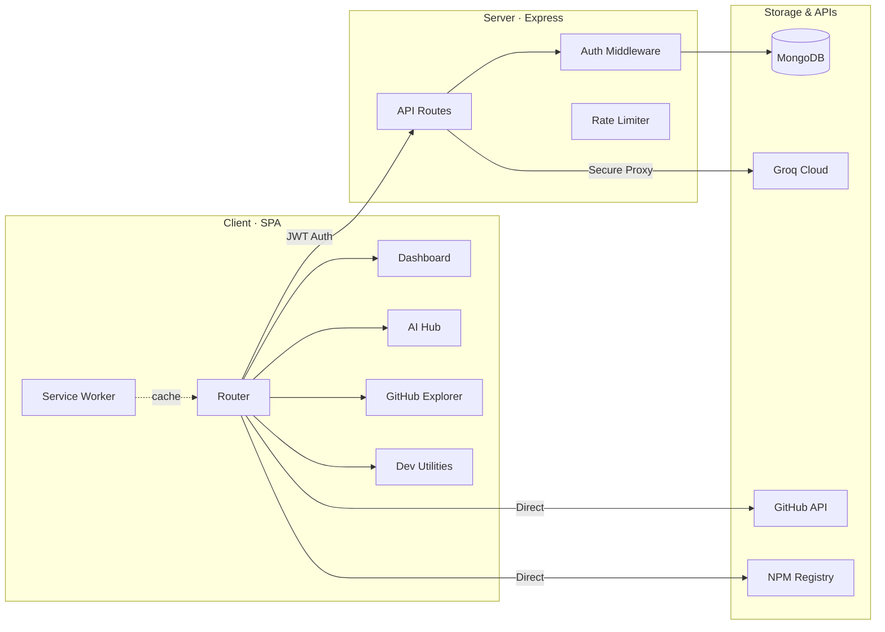

<div align="center">
  

  # TrivoXa

  **A unified, high-performance workspace for modern engineers**

  [](https://makeapullrequest.com)

</div>

<br>

TrivoXa is a browser based developer toolkit that consolidates scattered utilities into a single, cohesive workspace. It combines AI powered project scaffolding, 3D repository visualization, package analysis, API testing, and a personal developer workspace into one monochrome interface engineered for deep work.

<br>

## Table of Contents

- [Architecture](#architecture)
- [Tech Stack](#tech-stack)
- [Modules](#modules)
- [API Reference](#api-reference)
- [Project Layout](#project-layout)
- [Getting Started](#getting-started)
- [Developer Workflow](#developer-workflow)
- [Security Model](#security-model)
- [Contributing](#contributing)

<br>

## Architecture



<br>

## Tech Stack

**Frontend**

| Component    | Implementation                              |
| :----------- | :------------------------------------------ |
| Language     | Vanilla JS (ES6+ modules)                   |
| Styling      | Custom CSS design system with CSS variables |
| Routing      | Custom SPA router using the History API     |
| 3D Rendering | Three.js + 3D Force Graph (lazy-loaded)     |
| Offline      | PWA with service worker caching             |

**Backend**

| Component | Implementation                        |
| :-------- | :------------------------------------ |
| Runtime   | Node.js with Express                  |
| Database  | MongoDB via Mongoose ODM              |
| Auth      | JWT tokens with bcryptjs hashing      |
| AI Layer  | Groq Cloud (Llama 3.1 models)         |
| Security  | CORS, rate limiting, input validation |

**External Services**

Groq Cloud (Llama 3.1) · GitHub REST API · NPM Registry API · MongoDB Atlas

**Deployment**

Vercel — serverless functions + static hosting

<br>

## Modules

### 01 · AI Hub

An intelligent development environment backed by Groq's high-speed inference.

- **AI Chat** — a stateful, context-aware assistant for debugging errors, refactoring code, designing schemas, and discussing architectural decisions.
- **AI Architect** — accepts high-level project descriptions and generates complete directory structures with executable scaffolding scripts.
- **AI Stacks** — evaluates technology combinations, analyzing compatibility, performance, and ecosystem maturity.

```bash
# Example output from AI Architect
mkdir -p project/{backend/routes,frontend/components,shared}
cd project && npm init -y && npm i express mongoose dotenv
```

*Best for: scaffolding new projects, debugging runtime errors, comparing tech-stack tradeoffs, generating schemas, and prototyping APIs.*

### 02 · My Workspace

A centralized productivity layer to organize project resources and reduce context switching.

- **Project Folders** — create custom directory structures in the browser to group notes, endpoints, tool bookmarks, and command references by project.
- **Resource Bookmarks** — connect directly to the Free APIs index, Tools Vault, and AI Chat history; save any resource to your active folder in one click.
- **Quick Notes** — rich text and code block storage alongside your bookmarks, keeping documentation and planning in one place.

*Workspace stores: project folders, bookmarked APIs and tools, AI chat exports, CLI references, and code snippets.*

### 03 · GitHub Explorer

Spatial visualization of repository architecture using WebGL rendering.

- **3D Repo Visualizer** — renders any public GitHub repository as a force-directed graph. Directories become clusters, files become nodes, and depth relationships become visible spatial connections. Built on Three.js and 3D Force Graph, both loaded on demand.
- **Git Insights** — surfaces repository metrics, language distribution, and configuration details in one view.
- **User Explorer** — search GitHub profiles to analyze contributor patterns, repository ownership, and public activity.

*Best for: onboarding to unfamiliar codebases, auditing structure, understanding dependency graphs, and reviewing contributor activity.*

### 04 · Developer Utilities

A consolidated suite of essential tools to eliminate tab-switching during development.

- **Package Scout** — deep analysis on NPM packages: download trends, bundle overhead, dependency trees, and maintenance indicators.
- **Free APIs Directory** — indexes 100+ public REST endpoints with built-in sandbox testing to preview response structures.
- **Tools Vault** — catalogs framework boilerplates, libraries, coding assistants (Claude Code, Copilot CLI, Gemini CLI, Codex, Aider, Continue), VS Code extensions, and ML/data-science and app-dev utilities.
- **Commands Library** — searchable CLI references for Git, NPM, Docker, Kubernetes, Linux, and Terminal, with copy-to-clipboard support.
- **Docs Search** — connects to technical documentation sources with persistent search history.

<br>

## API Reference

All protected routes require a `Bearer <token>` header. Rate limits are enforced per IP.

**Authentication**

| Route                 | Method | Auth   | Rate Limit       | Description                        |
| :--------------------- | :----- | :----- | :---------------- | :---------------------------------- |
| `/api/auth/register`   | POST   | Public | 10 req / 15 min   | Create account, receive JWT         |
| `/api/auth/login`      | POST   | Public | 10 req / 15 min   | Validate credentials, receive JWT   |
| `/api/auth/me`         | GET    | JWT    | Global             | Retrieve current session data       |

**AI & Workspace**

| Route                | Method                 | Auth | Rate Limit       | Description                         |
| :-------------------- | :--------------------- | :--- | :---------------- | :------------------------------------ |
| `/api/groq/chat`      | POST                    | JWT  | 20 req / 15 min   | Stream AI response from Groq          |
| `/api/ai-history`     | GET · POST · DELETE    | JWT  | Global             | Manage saved AI conversations         |
| `/api/snippets`       | GET · POST · DELETE    | JWT  | Global             | CRUD for workspace code snippets      |
| `/api/docs-history`   | GET · POST · DELETE    | JWT  | Global             | Track documentation search queries    |

<br>

## Project Layout

```
trivoxa/
│
├── api/                     # Serverless function entry points (Vercel)
├── server/
│   ├── config/              # Database connection configuration
│   ├── middleware/          # JWT auth verification middleware
│   ├── models/              # Mongoose schemas (User, Snippet, History)
│   └── routes/               # Express route handlers
│       ├── auth.js          #   Registration, login, session
│       ├── groq.js          #   Groq AI proxy with streaming
│       ├── snippets.js      #   Workspace snippet CRUD
│       ├── aiHistory.js     #   AI conversation persistence
│       └── docsHistory.js   #   Documentation search tracking
│
├── js/
│   ├── core/                # SPA router engine and boot system
│   ├── ai/                  # AI Chat, Architect, Stacks interfaces
│   ├── auth/                # Login/register modals and JWT management
│   ├── dashboard/           # Landing page and primary workspace UI
│   ├── docs/                # Documentation search engine
│   ├── git/                 # 3D repository explorer (Three.js)
│   ├── tools/                # Package Scout, APIs, Tools Vault, Commands
│   ├── workspace/            # Folder trees, notes, snippet management
│   ├── ui/                   # Navbar, layouts, loading states
│   └── utils/                # Fetch wrappers, DOM helpers, formatters
│
├── css/
│   ├── base.css              # Reset, typography, CSS custom properties
│   ├── layout.css            # Grid systems, responsive breakpoints
│   ├── components.css        # Reusable UI component styles
│   ├── pages.css             # Page-specific module styles (imports)
│   └── animations.css        # Keyframes and transition definitions
│
├── data/
│   ├── apis.json             # 100+ public API endpoint catalog
│   ├── commands.json         # Git, NPM, Terminal, Docker, Kubernetes CLI reference
│   ├── tools.json             # Developer tools, ML, and app-dev assistant directory
│   └── extensions.json       # VS Code extension recommendations
│
├── public/                   # Favicon, manifest, icons, service worker
├── scripts/                  # Setup and diagnostic test scripts
├── index.html                 # SPA shell and entry point
├── package.json               # Dependencies and npm scripts
└── vercel.json                 # Serverless deployment configuration
```

<br>

## Getting Started

### Prerequisites

| Requirement   | Version | Purpose                    |
| :------------- | :------ | :-------------------------- |
| Node.js        | v18+    | Runtime for backend server   |
| MongoDB        | v6+     | Data persistence layer       |
| Groq API Key   | Current | AI inference access          |

Get a Groq API key at [console.groq.com](https://console.groq.com).

### Running

| Command              | What it does                                              |
| :-------------------- | :----------------------------------------------------------|
| `npm run both`        | Start frontend (`:8080`) and backend (`:3001`) together     |
| `npm run dev`         | Start the frontend server only                               |
| `npm run proxy`       | Start the backend proxy server only                          |
| `npm run proxy:dev`   | Start the backend with nodemon auto-reload                   |
| `npm run test:api`    | Validate Groq API connectivity                                |
| `npm run test:site`   | Verify application route health                               |

<br>

## Developer Workflow

A typical project build moves through all four modules in sequence:

1. **AI Stacks** — compare technology combinations and select a stack suited to your performance and scalability requirements.
2. **AI Architect** — describe your project in plain language; the system generates a folder structure and a terminal script to scaffold it locally.
3. **My Workspace** — create a project folder and bookmark the recommended tools, stack templates, and CLI commands.
4. **Package Scout** — compare candidate NPM packages by bundle size, download velocity, and dependency overhead before installing.
5. **Free APIs Directory** — browse and test endpoints in the sandbox, then bookmark useful ones to your workspace folder.
6. **AI Chat** — debug errors, discuss optimization strategies, and get code explanations as development continues.

<br>

## Security Model

**Authentication flow**

1. Client sends credentials to `POST /api/auth/register` or `/api/auth/login`.
2. Server hashes the password with bcryptjs and stores the record in MongoDB.
3. Server returns a signed JWT to the client.
4. Subsequent requests include `Authorization: Bearer <token>`; the server verifies the JWT before returning protected data.

**Rate limiting**

| Endpoint Group          | Limit         | Window      |
| :------------------------ | :------------- | :------------ |
| Global (all routes)       | 100 requests   | 15 minutes     |
| Auth (login/register)     | 10 requests    | 15 minutes     |
| AI (Groq proxy)            | 20 requests    | 15 minutes     |

CORS is restricted to known origins. The Groq API key is never exposed to the client — all AI requests are proxied through the Express backend.

<br>

## Contributing

Contributions are welcome. Fork the repository, create a feature branch, and open a pull request.

```bash
git checkout -b feature/your-feature
git commit -m "feat: description of change"
git push origin feature/your-feature
```

<br>

<div align="center">
  <sub>Designed and engineered by <a href="https://github.com/adityajha-coder">Aditya Jha</a></sub>
</div>
